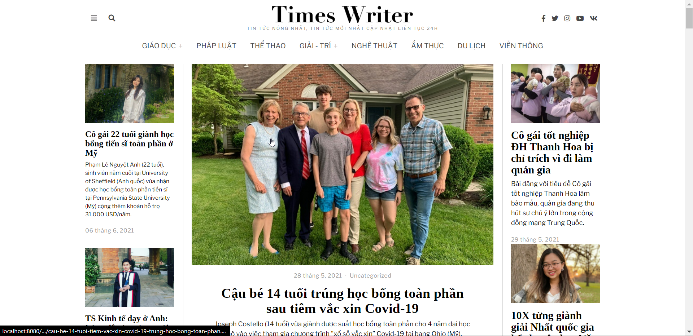
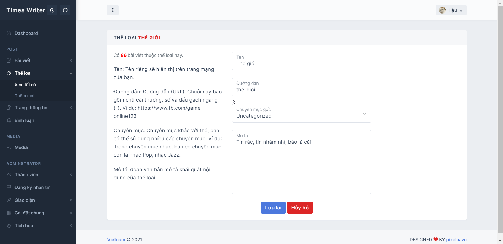

<h1 align="center">Lập Trình Web</h1>
<h2 align="center">Trang tin tức - xã hội - giải trí</h2>

# [**Table of contents**](#table-of-contents)

- [**Table of contents**](#table-of-contents)
- [**Topic**](#topic)
- [**Feature**](#feature)
- [**Utilization**](#utilization)
- [**Photo**](#photo)
- [**Tool**](#tool)
- [**Our Team**](#our-team)

# [**Topic**](#topic)

Chủ đề của nhóm mình là xây dựng một trang tin tức tổng hợp như kenh14.vn, tinhte.vn, dantri.com

# [**Feature**](#feature)

Trang web này có những chức năng cơ bản của một web truyền thống nhất bao gồm:
1. Giao diện hiển thị cho khách xem trang web
   
2. Giao diện hiển thị cho người quản trị viên
   
3. Đầy đủ các tính năng quản lý bài viết, thể loại, trang tin tức, sắp xếp thứ tự menu, bài viết ưu tiên....
   
4. Hỗ trợ đăng ký nhận tin với email
   
5. Tính năng phân quyền, khôi phục mật khẩu,....

6. Lưu trữ các cài đặt trang 
   
7. Quản lý menu đa cấp
   
8.  Tối ưu hóa hiển thị trên mọi kích cỡ màn hình
   
# [**Utilization**](#utilization)

Để chạy được dự án này các bạn cần chuẩn làm các bước sau

1. Tải và giải nén dự án này về bằng lệnh  `git clone`  hoặc chọn Code -> Download Zip.

2. Sao chép đoạn SQL Script để tạo cơ sở dữ liệu cho dự án.

3. Mở dự án với phần mềm Elipse IDE.

4. Click chuột phải chọn vào tên dự án chọn Run as -> Run on server ( lưu ý phải cài đặt sẵn Tomcat Server tư phiên bản 9 trở lên )

# [**Photo**](#photo)

Phần này xin giới thiệu với các bạn một số hình ảnh của sản phẩm này:

1. Giao diện cho khách tham quan

    

2. Màn hình đăng nhập quản trị viên
   

    

3. Giao diện người quản trị viên - Quản lý bài viết

    

4. Giao diện người quản trị viên - Quản lý thể loại

    

5. Giao diện người quản trị viên - Chỉnh sửa thể loại

    

  

# [**Tool**](#tool)
Phần này xin giới thiệu tới các bạn thông tin chi tiết về các phần mềm được sử dụng trong dự án này

1. Elipse IDE - phiên bản 03-2019 hoặc mới hơn, nhấn vào [**đây**](https://www.eclipse.org/downloads/packages/release/2019-03) để tải

2. SQL Server - phiên bản 2014 Enterprise hoặc mới hơn, nhấn vào [**đây**](https://www.microsoft.com/en-us/sql-server/sql-server-downloads) để tải

3. Tomcat Server - phiên bản 9 hoặc mới hơn, nhấn vào [**đây**](https://tomcat.apache.org/tomcat-9.0-doc/index.html) để tải 
# [**Our Team**](#our-team)
<table>
    <tr>
     <td align="center">
        <a href="https://github.com/Phong-Kaster">
            
             
            <b>Nguyễn Thành Phong</b>
        </a>
    </td>
        <td align="center">
        <a href="https://github.com/ngdanghau">
            
             
            <b>Nguyễn Đăng Hậu</b>
        </a>
    </td>
      <td align="center">
        <a href="https://github.com/nhoxkhang2014">
            
             
            <b>Lương Đình Khang</b>
        </a>
    </td>
    </tr>
</table>
