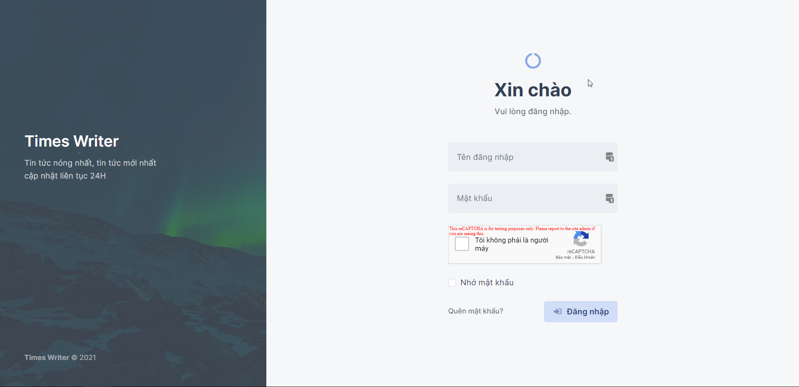
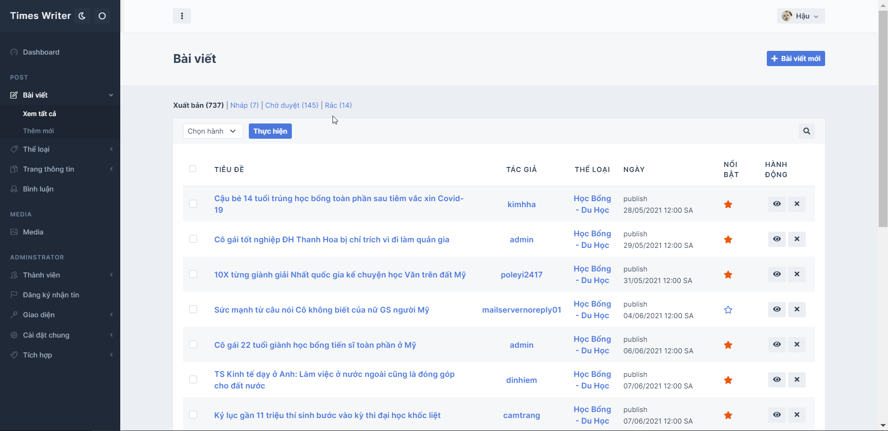
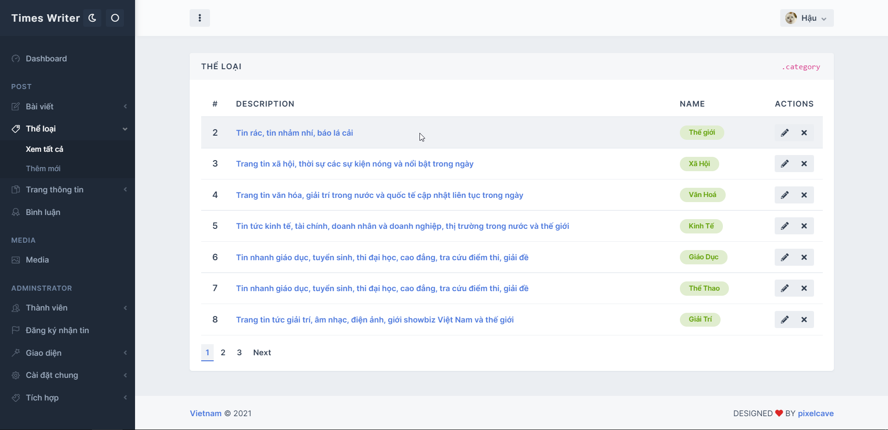

<h1 align="center">Lập Trình Web 
Trang tin tức - xã hội - giải trí</h1>

 
      

# [**Table of contents**](#table-of-contents)

- [**Table of contents**](#table-of-contents)
- [**Topic**](#topic)
- [**Feature**](#feature)
- [**Utilization**](#utilization)
- [**Interview**](#interview)
- [**Photo**](#photo)
- [**Our Team**](#our-team)
- [**Credits**](#credits)
  - [**1.Nguyễn Thành Phong**](#1nguyễn-thành-phong)
  - [**2.Nguyễn Đăng Hậu**](#2nguyễn-đăng-hậu)
  - [**3.Lương Đình Khang**](#3lương-đình-khang)
- [**Tool**](#tool)

# [**Topic**](#topic)

Chủ đề của nhóm mình là xây dựng một trang tin tức tổng hợp như kenh14.vn, tinhte.vn, dantri.com

# [**Feature**](#feature)

Trang web này có những chức năng cơ bản của một web truyền thống nhất bao gồm:
1. Giao diện hiển thị cho khách xem trang web
   
2. Giao diện hiển thị cho người quản trị viên
   
3. Đầy đủ các tính năng quản lý bài viết, thể loại, trang tin tức, sắp xếp thứ tự menu, bài viết ưu tiên....
   
4. Hỗ trợ đăng ký nhận tin với email
   
5. Tính năng phân quyền, khôi phục mật khẩu,....

6. Lưu trữ các cài đặt trang 
   
7. Quản lý menu đa cấp
   
8.  Tối ưu hóa hiển thị trên mọi kích cỡ màn hình
   
# [**Utilization**](#utilization)

Để chạy được dự án này các bạn cần chuẩn làm các bước sau

1. Tải và giải nén dự án này về bằng lệnh  `git clone`  hoặc chọn Code -> Download Zip.

2. Sao chép đoạn SQL Script để tạo cơ sở dữ liệu cho dự án.

3. Mở dự án với phần mềm Elipse IDE.

4. Click chuột phải chọn vào tên dự án chọn Run as -> Run on server ( lưu ý phải cài đặt sẵn Tomcat Server tư phiên bản 9 trở lên )

# [**Interview**](#interview)

Hôm nay là Thứ năm, 09-12-2021. 

Mình viết thêm đoạn này để mô tả phần thi vấn đáp của nhóm tụi mình với thầy Nguyễn Trung Hiếu mà chúng mình mới thi sáng nay. Có thể tóm tắt nhanh là phần thi vấn đáp RẤT DỄ. Từng bạn sẽ được thi cùng thầy, ai làm chức năng nào ( như phần [**Credits**](#credits) ) thì sẽ 
trình bày đúng chức năng đó. Phần của 2 bạn cùng thi với mình thì mình không nhớ chi tiết. Về phần mình, đầu tiên, mình giới thiệu về các công việc đã làm cho phần front-end dành cho khách vào xem. Tiếp theo, mình giới thiệu các tính năng trong phần quản trị viên - admin. Thầy sẽ yêu cầu
chúng ta mở một đoạn chương trình | code xử lý nào đó.

Trong phần thi của mình, thầy yêu cầu mở phần chương trình xử lý việc cập nhật Thể Loại và đặt câu hỏi như: 

Đoạn chương trình này hoạt động như nào ? 

Biến `Session` em lấy ở đâu, khai báo như nào ? 

Mình diễn giải được ý nghĩa của đoạn chương trình. Và dĩ nhiên là giải thích `Session` được lấy ở `@Transactional` rồi.
Kế tiếp, thầy hỏi mình về việc tích hợp `CKFinder` - mặc dù mình không làm phần. Tuy nhiên, nếu
bạn có thể nhanh chóng mở được tệp tin config | configuration thì thầy sẽ không đặt thêm câu hỏi nào nữa. Phần này là để kiểm tra xem chúng ta có thực sự nắm được tổng quan đồ án mình đang làm hay không ?

"THÔI ĐƯỢC RỒI, MỜI BẠN TIẾP THEO" - Thầy nói. Vậy là phần thi của mình xong rồi á. 

Đơn giản chưa ? Nhanh quá !! Đọc xong nhưng không hiểu gì cả. OK OK, để mình tóm tắt nhanh nhé

- Thầy chỉ hỏi xoay quanh những chức năng đã làm. Không hỏi thêm bên ngoài

- Thầy sẽ hỏi một số thứ liên quan bên ngoài phần ta làm như: liên kết cơ sở dữ liệu ở đâu ? phần cấu hình Mail như nào ?

- Giải thích một đoạn chương trình nào đó như thêm - xóa - sửa ...

> Ngoài ra, hãy lưu ý nhưng vấn đề sau, khi thầy dạy chúng ta trong suốt một học kì nên có đầy đủ các chức năng sau trong bài

> 1. Đầy đủ tính năng THÊM - XÓA - SỬA - XEM

> 2. Có mã hóa mật khẩu đối với chức năng đăng ký tài khoản

> 3. Có tính năng gửi e-mail xác nhận

> 4. Có bắt các lỗi như: thiếu họ tên | CMND | số điện thoại thì phải hiện thông báo ra cho người dùng

> Nếu đầy đủ các chức năng được nêu trên. 100% các bạn sẽ đạt được điểm gần như tuyệt đối môn này. 

> Nhóm mình được 9.5 điểm là 1 ví dụ nè

# [**Photo**](#photo)

Phần này xin giới thiệu với các bạn một số hình ảnh của sản phẩm này:

1. Giao diện cho khách tham quan

    

2. Màn hình đăng nhập quản trị viên
   

    

3. Giao diện người quản trị viên - Quản lý bài viết

    

4. Giao diện người quản trị viên - Quản lý thể loại

    

5. Giao diện người quản trị viên - Chỉnh sửa thể loại

    

  

# [**Our Team**](#our-team)
<table>
    <tr>
     <td align="center">
        <a href="https://github.com/Phong-Kaster">
            
             
            <b>Nguyễn Thành Phong</b>
        </a>
    </td>
        <td align="center">
        <a href="https://github.com/ngdanghau">
            
             
            <b>Nguyễn Đăng Hậu</b>
        </a>
    </td>
      <td align="center">
        <a href="https://github.com/nhoxkhang2014">
            
             
            <b>Lương Đình Khang</b>
        </a>
    </td>
    </tr>
</table>

# [**Credits**](#credits)
## [**1.Nguyễn Thành Phong**](#nguyen-thanh-phong)
- Tạo cấu trúc thư mục chung cho cả project
- Tạo paging phân trang chung
- Chuyển template thành các file jsp cho front-end phía khách hang
- Chuyển template thành các file jsp cho front-end phía người quản trị
- Quản lý thể loại bài viết
- Quản lý trang thông tin
- Quản lý bình luận 
- Phản hồi bình luận từ admin
- Danh mục thể loại phía khách hàng
- Danh mục thông tin phía kháng hàng
- Sidebar của website
- Quản lý menu header, menu footer
- Chức năng kéo thả vị trí menu bằng con trỏ chuột
- Khai báo Client-Interceptor & Global-Interceptor

## [**2.Nguyễn Đăng Hậu**](#nguyen-dang-hau)
- Thiết kế CSDL
- Khai báo Entities( Options, General_Data)
- Config hibernate, spring-security, interceptor, mvc
- Tính năng đăng nhập
- Quản lý bài viết
- Quản lý thành viên 
- Quản lý đăng ký nhận tin
- Quản lý hồ sơ cá nhân
- Media
- Quản lý widget
- Thiết kế trang chủ website
- Tính năng tìm kiếm bài viết trên trang chủ
- Menu website
- Phân quyền
- Tích hợp ckeditor, ckfinder

## [**3.Lương Đình Khang**](#luong-dinh-khang)
- Khai báo Entities( Posts, Comment, Categories, Menu, Widget, Pages, Posts, Subscribers)
- Cắt template admin-settings, forgot password, reset password.
- Khai báo, config thư viện mailer
- Khai báo GlobalInterceptor.
- Cài đặt chung(logo, site, social) 
- Tích hợp (recaptcha, google analytics)
- Trang tác giả
- Tính năng reset password
- Tính năng đăng ký nhận tin
- Hiển thị thông tin covid
- Bình luận bài viết 
- Dashboard

# [**Tool**](#tool)
Phần này xin giới thiệu tới các bạn thông tin chi tiết về các phần mềm được sử dụng trong dự án này

1. Elipse IDE - phiên bản 03-2019 hoặc mới hơn, nhấn vào [**đây**](https://www.eclipse.org/downloads/packages/release/2019-03) để tải

2. SQL Server - phiên bản 2014 Enterprise hoặc mới hơn, nhấn vào [**đây**](https://www.microsoft.com/en-us/sql-server/sql-server-downloads) để tải

3. Tomcat Server - phiên bản 9 hoặc mới hơn, nhấn vào [**đây**](https://tomcat.apache.org/tomcat-9.0-doc/index.html) để tải 